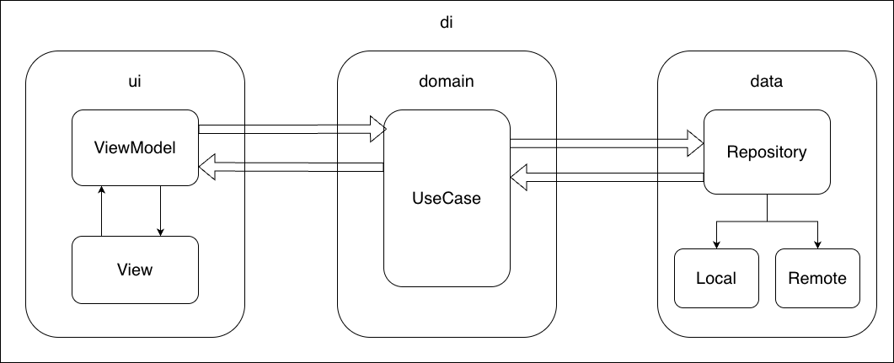

## Setup instructions
1. Clone the repository:
   ```
   git clone https://github.com/ilijatomic/OITestApp.git
   ```
2. Open project in Android Studio.
3. Sync Gradle files to download dependencies.
4. Connect an Android device or start an emulator.
5. Run the application from Android Studio.
6. In order to login into app use the following test credentials:
   - Username: admin
   - Password: admin
   
## Features implemented
1. Login
2. Dashboard (Home)
   - list of low stock items
   - list of last 10 transactions
3. Products
   - list of products with item showing name, description, supplier name, current stock (in red if below minimum stock)
   - search products by name, category, supplier, barcode
   - add new product
   - edit existing product
4. Suppliers
   - list of suppliers showing name, contact person, phone number
   - search suppliers by name, contact person, email
   - add new supplier
   - edit existing supplier
5. Transactions
   - list of transactions showing product name, quantity, date, type (restock/sale)
   - filter transactions by product name and type
   - add new transaction
6. Logout
7. Offline support
   - application works without active internet connection
   - assuming that sync would be added latter as feature that would re-trigger read from repository but this time use Remote instead of Local
8. Unit Tests
   - written unit test for Login and User (ViewModel, UseCase, Repository)
   - use `./gradlew test` command to run all Unit Test

## Architecture overview

The application follows the MVVM (Model-View-ViewModel) architecture pattern, utilizing the Repository pattern for data management and UseCases for business logic encapsulation.
